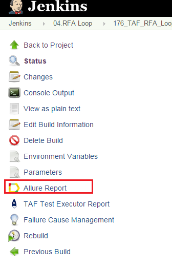
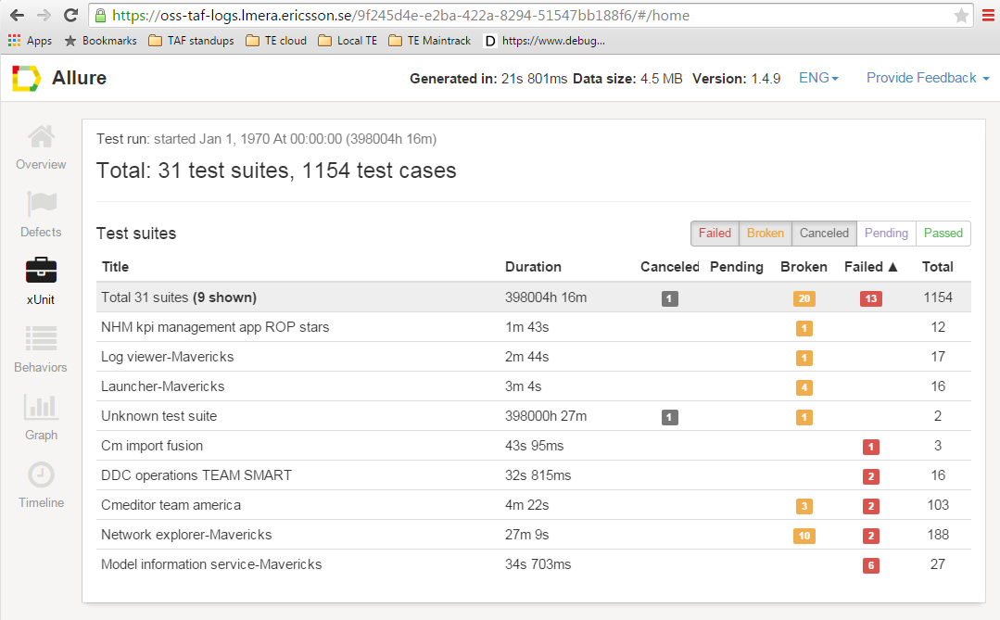

<head>
    <title>Allure Reports</title>
</head>

# Allure reports

After the tests are finished, TAF TE creates a single Allure report for ALL the tests that were included in the test run.

The report is available once test execution is complete. There will be a link to the Allure Report in the left menu on FEM Jenkins.

Please note that the link is NOT powered by Allure Jenkins plugin, it's powered by [TAF TE Trigger plugin](te_trigger_plugin.html).

