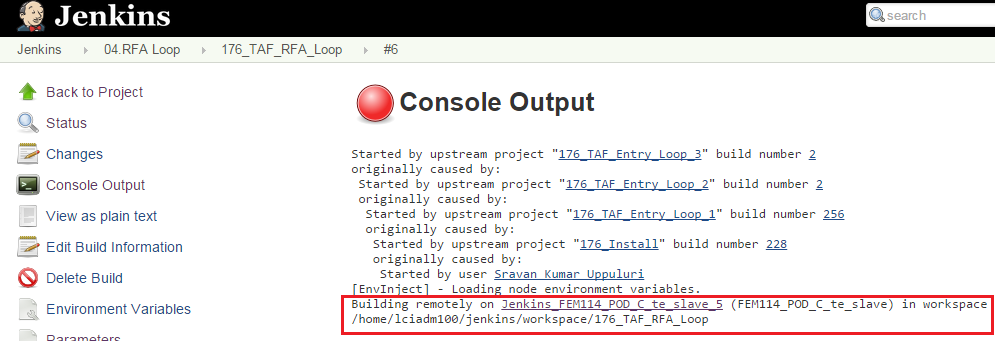
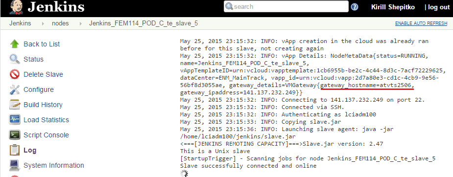
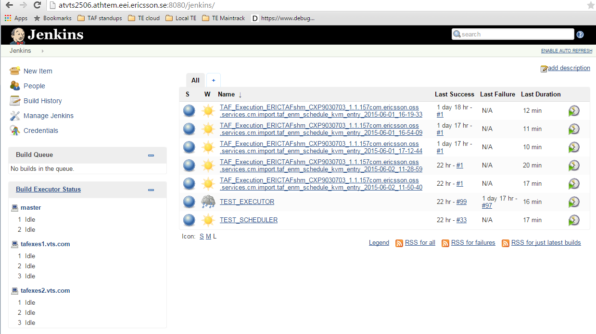
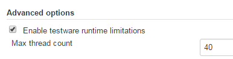

<head>
    <title>Debugging TE Execution</title>
</head>

# Debugging TE execution

TE execution logs that appear in FEM Jenkins log come from appropriate TE vApp where
the actual jobs are running. If you're wondering why one of the test executions failed
(if it's not clear looking at the log), need to check system resources or need to
re-run one particular test schedule item testware without re-running the whole job, you
need to go to appropriate TE vApp that was running the jobs.

To find out what TE vApp executed your tests, you need to go to the console log of your job.

## TE Cloud

If you use TE Cloud in your FEM Jenkins, you will see the name of the slave there.

Move mouse cursor to the link, and click the appeared dropdown icon. Then click the **"Log"** link in the appeared dropdown.
Find the vApp used as a slave:

Now you can connect to it (Jenkins port is 8080).

## Single TE vApp

If you specify the hostname of TAF Test Executor Jenkins master for your tests execution (which is NOT recommended!), you can find the definition of the
host and port (used for Jenkins) in the job's configuration (TAF Test Executor Jenkins host name).

## TE Jenkins

When you figured out the TE vApp that executed your tests, you can connect to it:

**TEST_EXECUTOR** (or **TAF_EXECUTOR** in older TE versions) project build denotes one execution of particular test
schedule item testware. To re-run it, you can request a re-build, like in case of
[full test re-build on FEM Jenkins](re_running_tests.html). Please note that it will NOT affect the test results
that you see on FEM Jenkins, as the main build process is already finished and Allure logs are already pushed to FTP server.

### Limit the number of threads that test execution can create

If you need to limit the number of threads that test execution can create (for example, if you have thread leaks and want to localize them),
 you can set a global limitation in **TEST_SCHEDULER** project configuration's *Advanced Options*:

If the JVM hits this limit, a thread dump will be printed. If defined, this value will be propagated to all executor jobs, so they
can be retriggered with the updated value if needed. Make sure the default value here is big enough, in order not to become a bottleneck.

This will apply to *EVERY* testware executed.
