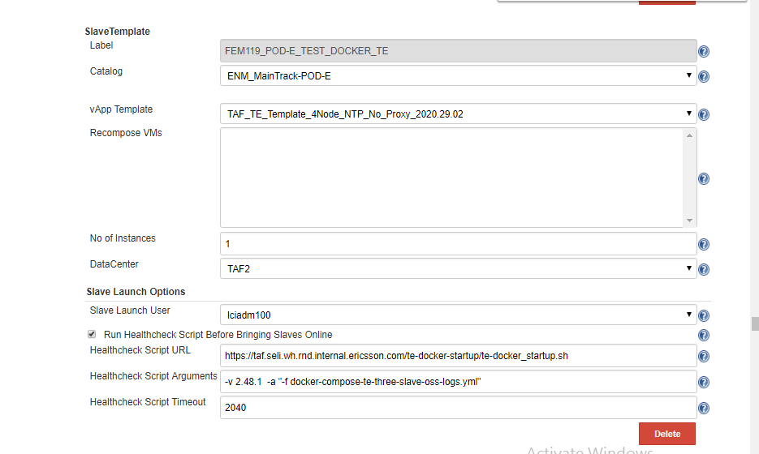

<head>
    <title>Dockerized TE</title>
</head>

# Dockerized TE

TE is now available using docker images. This page outlines how these docker images can be used to set up a TE.

## Spinning up a Dockerized TE via Jenkins configuration

Catalog and vApp Template can point towards any template that supports using docker and docker compose.
Ensure that the checkbox marked "Run Healthcheck Script" is selected. Once checked you will see the following input fields.


Healthcheck Script URL: https://taf.seli.wh.rnd.internal.ericsson.com/te-docker-startup/te-docker_startup.sh

Healthcheck Script Arguments: -v 2.xx.x -a "-f docker-compose-te-one-slave-oss-logs.yml"
Use the latest version of TE release in healthcheck script. Latest TE version will be displayed on [Taf landing](https://taf.seli.wh.rnd.internal.ericsson.com/) page under Test Executor version

Healthcheck Script Timeout: 2040

* **docker-compose-te-one-slave.yml** is a docker compose file that creates a docker Vapp with single slave container.Logs will not be uploaded to oss-logs FTP server but can be accessed using allure-service running on slave.

* **docker-compose-te-one-slave-oss-logs.yml** is a docker compose file that creates a docker Vapp with one slave container and uploads the logs to oss logs.

* **docker-compose-te-three-slave.yml** is a docker compose file that creates a docker Vapp with three slave containers.Logs will not be uploaded to oss-logs FTP server but can be accessed using allure-service running on slave.

* **docker-compose-te-three-slave-oss-logs.yml** is a docker compose file that creates a docker Vapp with three slave containers and uploads the logs to oss logs.

* Vapp template for docker based slaves can be selected from below types

    TAF_TE_Template_4Node_NTP_No_Proxy_2020.29.02
    TAF_TE_TEMPLATE_1NODE_NTP_No_Proxy_2019.11.11

URL points to where the startup script is hosted. This script will download a zip file from nexus containing the docker-compose yml files and
the dockerized_te.sh script. These files are used to start the docker containers based on a specific release version of TE. It will then unzip these file and execute dockerized_te.sh with
the arguments specified in the next input field.



Script Arguments are the arguments that are passed into the script when executing the startup script.

Required parameter is -v as this specifies the version of files to be downloaded from nexus.
Recommended version will be displayed on [Taf landing](https://taf.seli.wh.rnd.internal.ericsson.com/) page under Test Executor version
(Minimum supported version 2.19).

Optional parameter is -a, this takes whatever string you pass into it and then uses this string as arguments for the script contained
in the zip file, please see "Manually Spinning up a Dockerized TE" for arguments that can be passed into this script. For any args not specified, the default values will be set

## Manually Spinning up a Dockerized TE

### Requirements


The only requirement is that you have a host with `docker` and `docker-compose` installed. These can be installed on any linux box or alternatively you can use a `docker` vapp from the `TAF1 Catalog` catalog, the template is usually called `TAF_TE_Template_4Node_NTP_No_Proxy_2020.29.02`.

Once you have the requirements above in place, it is possible to spin up a dockerized TE using a simple script that has been zipped up with some docker-compose example files and uploaded to nexus, download it here [Dockeried TE script zip file](https://arm1s11-eiffel004.eiffel.gic.ericsson.se:8443/nexus/service/local/artifact/maven/redirect?r=releases&g=com.ericsson.cifwk.taf.executor&a=te-docker&p=zip&v=LATEST). This zip file can be downloaded directly to a linux box with a command like this (make sure to change the version)

```sh
curl -O https://arm1s11-eiffel004.eiffel.gic.ericsson.se:8443/nexus/service/local/repositories/releases/content/com/ericsson/cifwk/taf/executor/te-docker/2.37.1/te-docker-2.37.1.zip
```

*NOTE:* Make sure to update version to the latest TE version before running the above command.

Once downloaded and unzipped, you can run the script with the '-h' option to see the script options.

```sh
# bash dockerized_te.sh -h

Script to deploy TE
  - pulls images from docker registry
  - spins up containers using docker-compose

Usage: dockerized_te.sh [option...]
  -h                          Show help
  -n hostname                 Set hostname, defaults to machine hostname
  -f compose-file             Set docker-compose file to use, defaults to 'docker-compose-te-one-slave.yml'
  -a arm_url                  Set ARM to use, defaults to 'https://arm1s11-eiffel004.eiffel.gic.ericsson.se:8443/nexus/content/groups/public'
  -c executor_count           Set the executor count on the TE slaves, defaults to '4'
  -o offline                  Set the maven offline mode, default is 'false'"
```

If you run the script without any options i.e. accept all defaults then a dockerized TE will be spun up and if all goes well, should be available on port `8080/jenkins` on your linux box e.g. `http://141.137.172.200:8080/jenkins/`


If a bigger TE is needed the script is parameterised to take a `docker-compose` file e.g.

```sh
# bash dockerized_te.sh -f docker-compose-te-three-slave.yml
```

**NOTE:** At the moment there are five `docker-compose` files packed in the zip on nexus:

        1. The single slave option with allure-service
        2. The single slave option with allure-service and oss logs upload
        3. The three slave option with allure-service
        4. The three slave option with allure-service and oss logs upload
        5. The option to download testware depencencies.

If something else is needed please contact the TAF team.