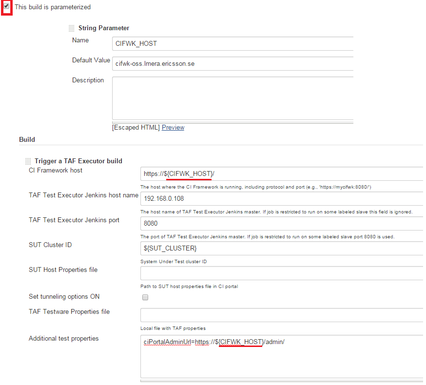
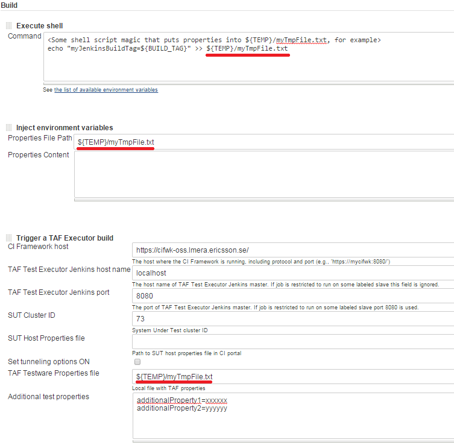

<head>
    <title>Test Run Configuration Best Practices</title>
</head>

# Test run configuration best practices

## Jenkins environment variable usage

You can reference the environment variables in all of the fields provided in the job configuration using the placeholder
`${<variable_name>}` - e.g., ${JENKINS_HOME}, ${myVariable}. The appropriate value will be used during the build.

### Define variables only once

If you need to use the same value a few times, you can create a build parameter and reference it later as many
times as you want.

### Need to run script before test? Feed the result data to TE

This is sometimes needed when you need to run some scripts to prepare the data for the test.

To expose your own variables as environment variables (and pass them as additional test properties to TE) you need to:

* Install [EnvInject plugin](https://wiki.jenkins-ci.org/display/JENKINS/EnvInject+Plugin) on EIS Jenkins.
* Add **"Execute shell"** build step to the job. Execute whatever you want there and output the results into a tmp file (you can use `/tmp/${BUILD_TAG}` for this).
Each line in this file should be in format `<property_name>=<property_value>`.
* Add **"Inject environment variables"** build step (powered by **EnvInject Jenkins plugin**) to the job, referencing this file.
* After this build step you can add **"Trigger a TAF Executor"** build step and reference the variables from your
tmp property file using notation `${<property_name>}`.

#### Example:

