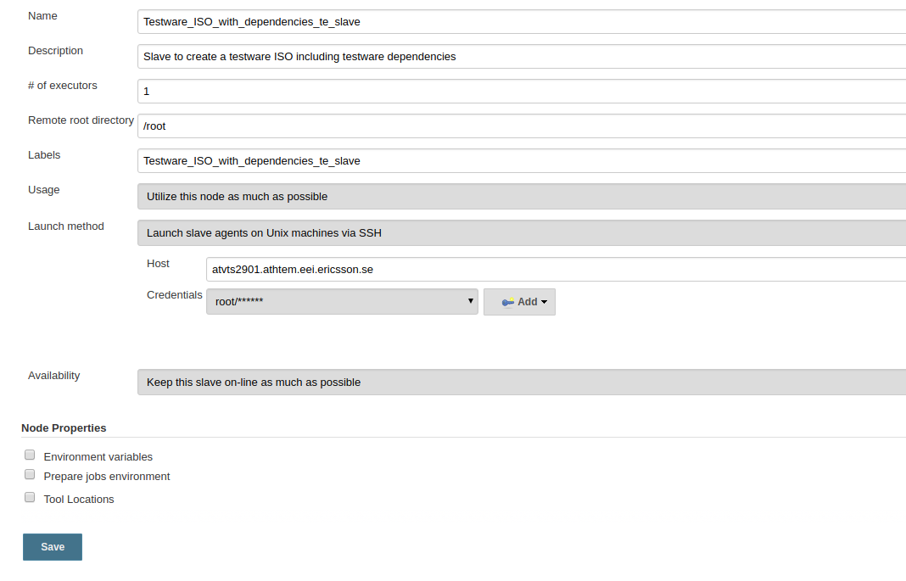
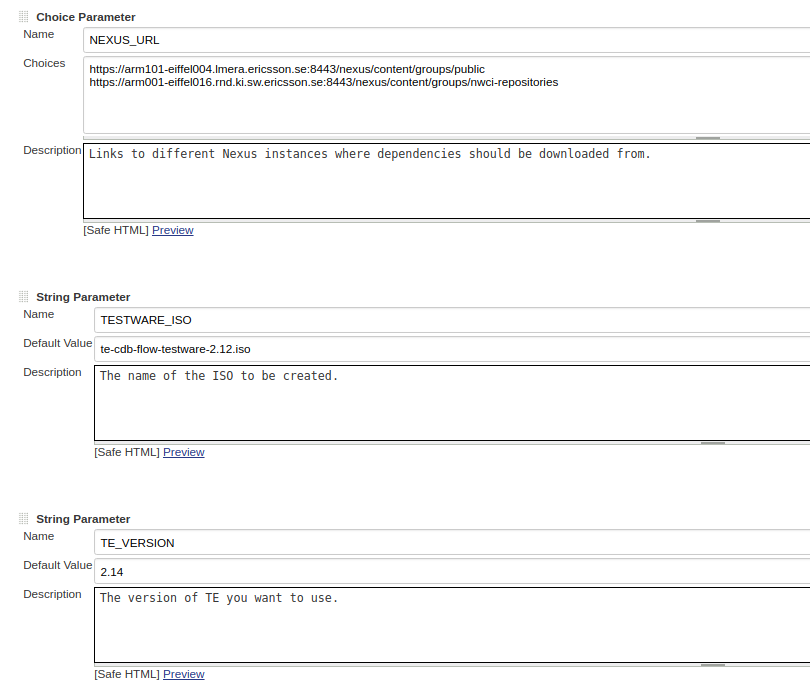
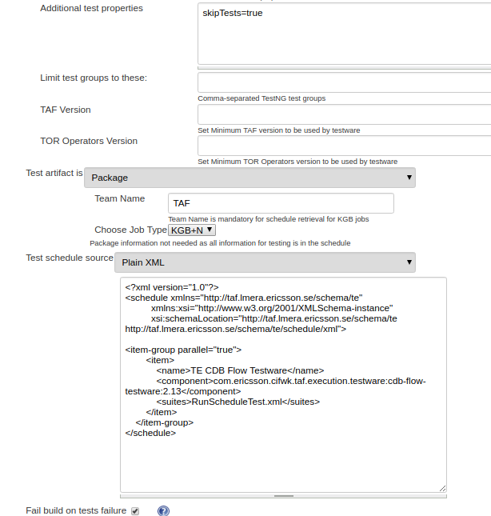
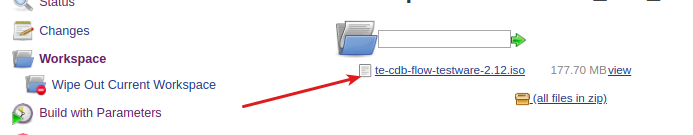

<head>
    <title>How to use TE to create a testware ISO with dependencies</title>
</head>

# How to use TE to create a testware ISO with dependencies.

TE populates a local maven repository which can be packed in an ISO, distributed and used in a closed environment where a connection back to an Artifact Repository is not possible. The easiest way to achieve this is to put all the steps in a jenkins job that runs on a TE created specifically for this purpose.


## Create the jenkins slave and attach to the FEM.

The slave can be attached in a number of ways <br/>
1. Use the SSH Slaves plugin [wiki link](https://wiki.jenkins.io/display/JENKINS/SSH+Slaves+plugin). <br/>An example configuration <br/><br/>
2. LMI Cloud Plugin [Confluence link](https://confluence-nam.lmera.ericsson.se/display/CIE/LMI-Cloud+Plugin)

## Configure the jenkins job.

### Step 1 - Create a new jenkins job.

Create a new "Freestyle project" on jenkins

### Step 2 - Make the job parameterized.

Add the following parameters

| Type | Name | Value |
|---|---|---|
| Choice Parameter| NEXUS_URL | Add links to different Nexus instances |
| String Parameter | TESTWARE_ISO | Add a default name for the testware ISO |
| String Parameter | TE_VERSION | Add the version of TE you want to use |
Example <br/>


### Step 3 - Add an 'Execute Shell' build step to install 'mkisofs' and spin up TE.
Populate the 'Command' text box with the following

```
#echo "[INFO] Install mkisofs if it is not already installed"
yum install -y mkisofs

REPO_FOLDER=/tmp/repository

#Create repository folder if it does not exist
if [ ! -d "$REPO_FOLDER" ]; then
  echo "$REPO_FOLDER is not present, it will be created"
  mkdir -m 777 $REPO_FOLDER
fi

echo "[INFO] Download and unzip Docker TE zip"
curl https://arm1s11-eiffel004.eiffel.gic.ericsson.se:8443/nexus/service/local/repositories/releases/content/com/ericsson/cifwk/taf/executor/te-docker/${TE_VERSION}/te-docker-${TE_VERSION}.zip -o te_docker.zip
unzip -o te_docker.zip

echo "[INFO] Bringing up docker containers"
bash dockerized_te.sh -f docker-compose-download-dependencies.yml

#Get the TE/TAF dependencies
cd $REPO_FOLDER
curlhttps://taf.seli.wh.rnd.internal.ericsson.com/TE_dependencies/TE_dependencies.zip -o TE_dependencies.zip
unzip -o TE_dependencies.zip
rm -f TE_dependencies.zip

echo "[INFO] Waiting for TE to be up and running"
sleep 30
```

### Step 4 - Add the 'Trigger a TAF TE build' build step.
Add the build step as normal. There are a couple of things to note:

- 'Additional test properties' section should contain the property 'skipTests=true'
- 'Test schedule source' should contain the schedule for the testware that you need the dependencies for.
- 'HTTP URL' section should contain '${NEXUS_URL}'

Example <br/>


### Step 5 - Add another 'Execute Shell' build step to create the ISO.
Populate the 'Command' text box with the following

```
#Create ISO
echo "[INFO] Creating testware ISO"
cd /root
mkisofs -rock -o ${TESTWARE_ISO} /tmp/repository/
cp /root/${TESTWARE_ISO} ${WORKSPACE}
```

That should be it, build the job and the ISO should be available in the jenkins job's workspace


