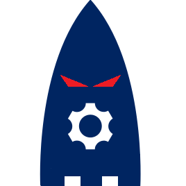

<head>
    <title>Introduction</title>
</head>

# Introduction

<!--  -->
<!--Testing E2C FEM -->
<!--  -->

TAF Test Executor (TE) is a distributed system for scheduling, executing and reporting testcases.

TAF TE is based on Jenkins infrastructure and consists of 2 parts:

  * [Test Execution vApp](te_vapp.html)
  * [TE trigger plugin for Jenkins](te_trigger_setup.html)

The TE solution is integrated with the LMI cloud plugin, to allow easy deployment of TE vApps

  * [TE Cloud](te_cloud.html)

TE is also integrated with Eiffel components such as ARM, FEM, MB and ER

  * [Eiffel](https://eiffel.lmera.ericsson.se/)

TAF TE provides an easy way to distribute the execution of testwares and run them in an isolated environment for quickest feedback possible.
As a result you also get a single Allure report for all your tests, even if they are distributed into different packages - right in your Jenkins job's summary page!

See the list of all available features [here](features.html)

All you need for TAF TE is a FEM Jenkins with a trigger plugin installed and a pool of TE slave vApps.
