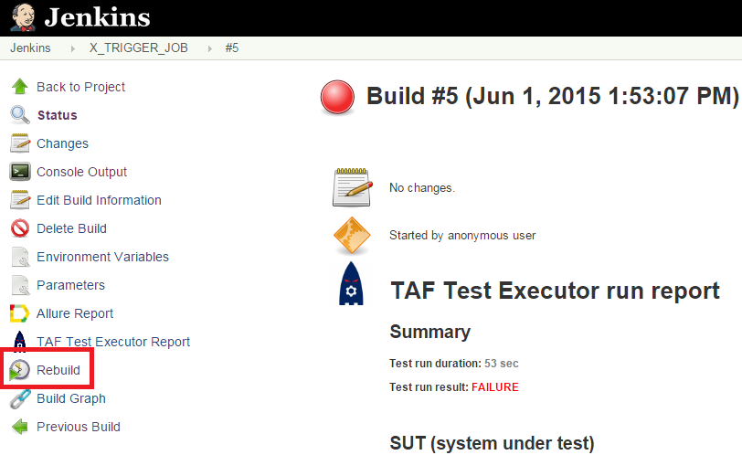
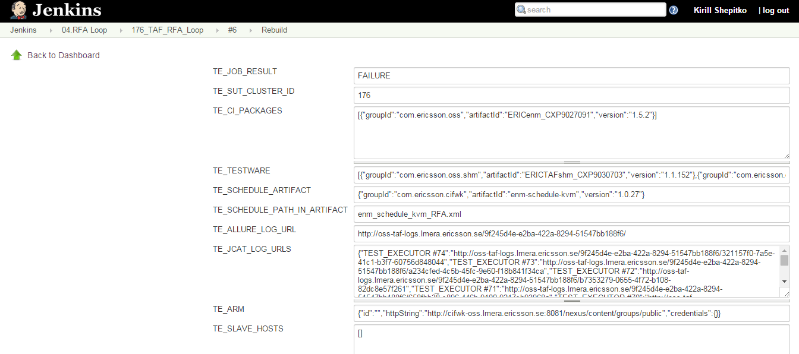

<head>
    <title>Re-running Tests</title>
</head>

# Re-running tests

Sometimes you may want to re-run your tests, if there was some kind of system error
(like networking issue) that prevented the tests from running normally.

In this case you need to select your FEM Jenkins job, powered by TAF TE Trigger plugin,
and rebuild it:

When you click "Rebuild", Jenkins will show the page with the build parameters. In this case
the new build will not take the data from CI portal, it will take all necessary data from the
old build, to replicate it completely.

