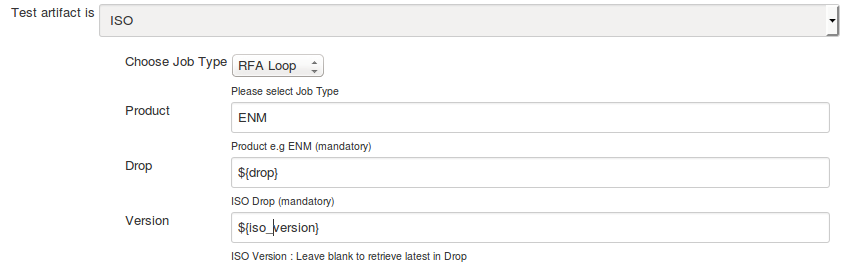
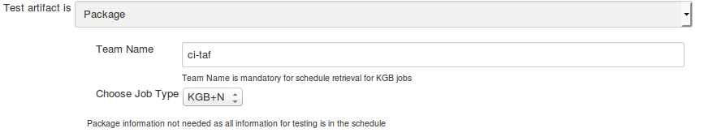

<head>
    <title>RFA Tests</title>
</head>

# RFA tests

To run the RFA tests select **ISO** in the **Test artifact is** dropdown.

In this case all the testware mapped to the particular version of the ISO will be run.

# KGB tests

To run the KGB tests select **Package**.
No additional information is needed, testware is specified in schedule and versions are retrieved from Nexus if they are not specified.

Team name must be specified when using scheduler as the schedule source.
