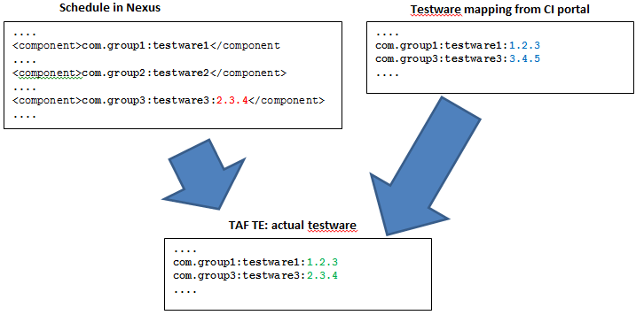

<head>
    <title>Test Schedule FAQ</title>
</head>

# Test schedule FAQ

## Where should I store my schedule?

The schedule can be stored:

* in TAF Scheduler application
* in a Maven JAR artifact available in Nexus. Ideally the schedule should be stored in the same artifact as testware
* in Trigger job configuration (not recommended)

see [here](schedule_source.html)

So TE testware should contain:

* TestNG tests
* Test suites
* schedule(-s) that reference(-s) the suites (Optional).

## What version of testware will be run by TE engine?

The testware component is identified by Maven group and artifact names. The version definition is optional. However, as known, Maven artifact is uniquely identified by group, artifact and version. Why version is optional?

This is explained by the way that TE resolves the artifacts. When receiving the build trigger request, TE is not receiving only schedule name and schedule artifact's GAV in it. It also receives the list of testware from the mapped testware ISO in the CI portal - where the testware is identified by GAV.

Here are the simple rules for testware version definition:

* If testware version is hard-coded in schedule (should be used in exceptional cases), this version will be used anyway - even there's another version defined in CI portal's testware mapping
* If testware version is not defined in schedule, but it's delivered to the corresponding testware ISO in the CI portal, the version in the testware ISO will be used
* If testware version is not defined in schedule, and the testware mapping in undefined in CI portal, this testware will be bypassed by TE

Exception to this is when test artifact is set to Package (KGB job), in this case the latest versions are taken from nexus.

Here's the example of these rules:

Since version 1.2.3 defined for com.group1:testware1 in CI portal, it will be used for tests. 
Since version 2.3.4 hard-coded for com.group3:testware3 in the schedule, it will be used for tests - despite the mapping to version 3.4.5 in CI portal. 
As com.group2:testware2 is not mapped at all, it's bypassed.

TAF TE trigger plugin retrieves the testware from the testware ISO that is bound to the product ISO under test in CI portal.
All testware packages are identified in GAV format. This is the where TE gets the version for the schedule component (if group and artifact IDs match).

**Note** In the case where this schedule is used in KGB job, the latest versions will be taken from nexus for testware1 and testware2.

This allows to avoid the necessity of binding to a particular version, and make schedule always bound to CI testware mapping - therefore, no need to update schedule after every release. However, if in your schedule XML you are referring to a testware that is not mapped to the package-under-test in CI portal, you must define a version, otherwise your build will fail, because TE won't be able to find your testware.
