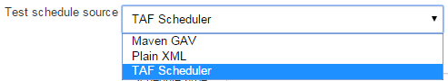
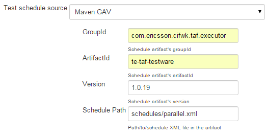
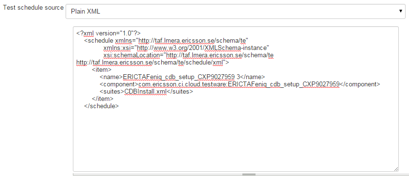
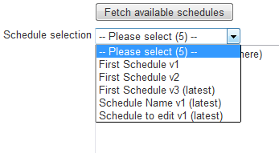
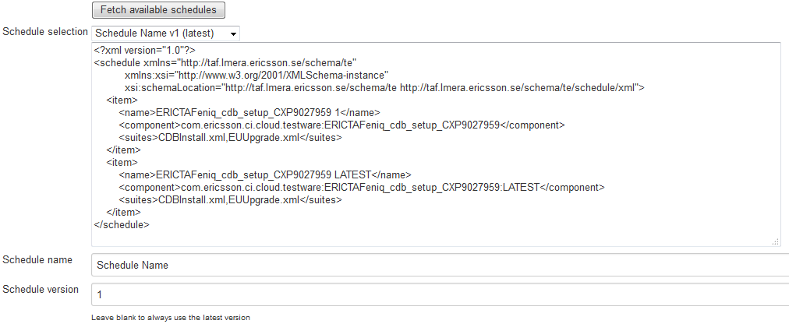
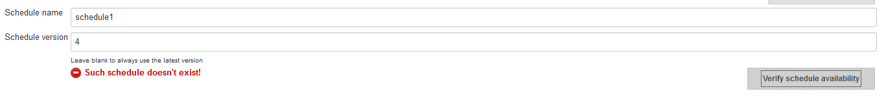

<head>
    <title>Schedule Source</title>
</head>

# Schedule source

There are a couple of options to select from the **Test schedule source** dropdown.

## Maven GAV schedule

Define **GroupId**, **ArtifactId**, **Version** of the Nexus artifact that contains TE test schedule. This should reference a JAR artifact.

**Schedule Path** - internal path to the schedule XML in the schedule artifact's JAR. If this XML is in JAR's root (like in the example above), no prefix is needed. If the XML is in some internal directory, it needs to be specified.

## Plain XML

Just paste your [schedule](schedule.html) XML here.

## TAF Scheduler

### NOTE! This is no longer supported.

### Schedule selection

User can manually write down schedule name and version. Version should have to be left blank in order to always get the latest.

However if user wants to browse for the schedule he wants, he should click **Schedule selection...** button.
Then a few more fields will appear:

To get the list of available schedules, click **Fetch available schedules** (please note that this will not work with
placeholders being used in any of **Product**, **Drop**, **Schedule name** or **Schedule version** fields! Placeholders
are resolved only during the build). A selection of schedules will appear:

Pick any of them, and you will get a preview of schedule content.
The name and version fields (the values that will be kept in job's configuration) will be populated automatically:

### Schedule verification

If you have set the schedule name and version by hand, it's handy to verify that such schedule exists.

To do this, click **Verify schedule availability**:

Please note that this functionality also won't work if you have placeholders in any of the **Product**, **Drop**,
**Schedule name** or **Schedule version** fields.

