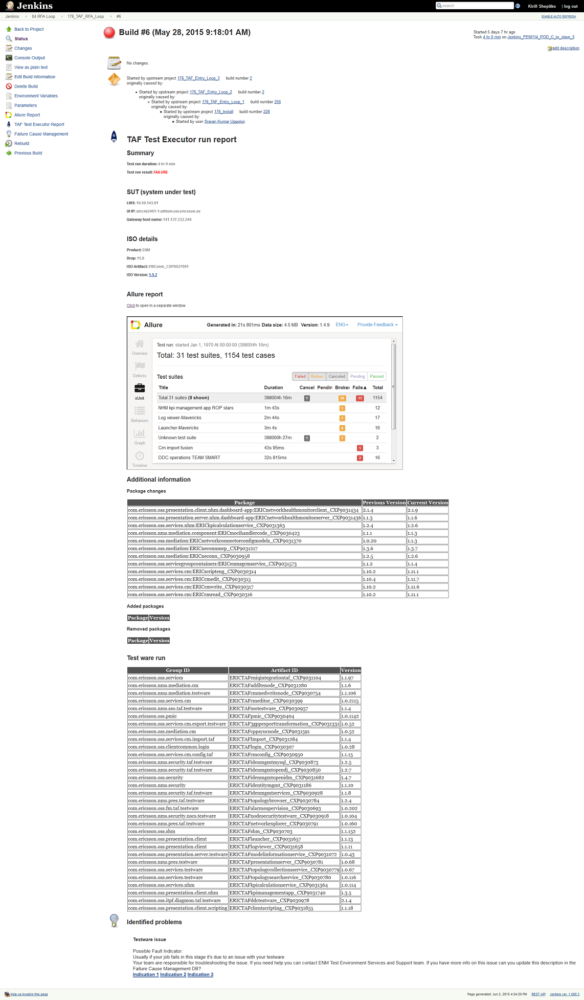

<head>
    <title>Summary Page</title>
</head>

# Summary page

When the TE test run is finished, Jenkins' build summary page will contain an entry added by the Trigger plugin.

It contains information about KGB/RFA test run (depends on your job configuration), testware that was run, etc.
Including the embedded Allure report:

This report is also available via a link in the menu on the left hand side on FEM Jenkins.

**Note:** In the case of an inability to kick off the test execution, the summary will contain an explanation of the cause of the problem.

