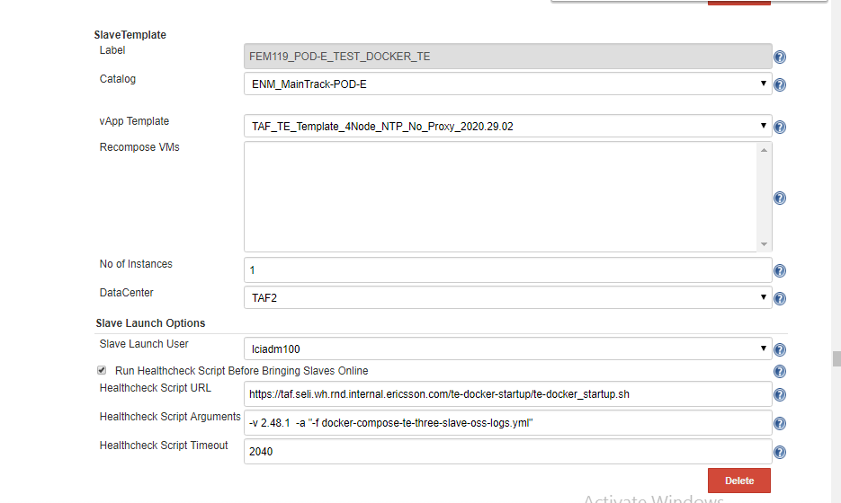
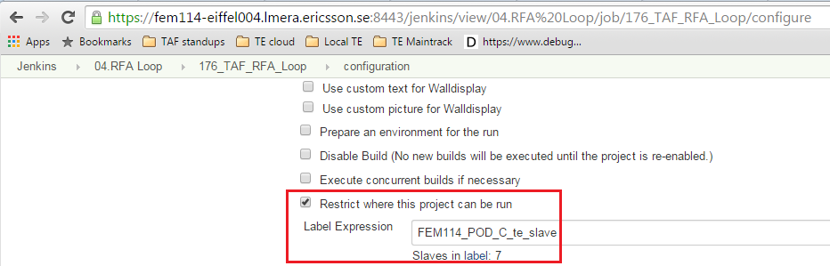

<head>
    <title>TE Cloud</title>
</head>

# TE cloud

TE cloud solution is implemented using [LMI Cloud plugin](http://confluence-nam.lmera.ericsson.se/display/CIE/LMI-Cloud+Plugin) in Jenkins.

This creates a pool of TE vApps, rolled out on demand, based on a particular version of TAF TE vApp template (stored in the cloud catalogue).

**Note:** There are different templates for RFA and KGB, RFA uses multiple node TE, KGB uses single node.

To create a pool of vApps, define a slave template in FEM Jenkins global config:

And then in the configuration of your build, powered by TAF TE Trigger plugin, bind the build run to an appropriate
 label that you defined in the global config for instances of TE cloud template:

