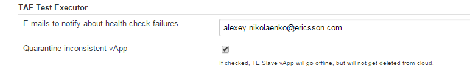

<head>
    <title>TE Slave Health Check</title>
</head>

#TAF Trigger plugin TE Slave health check

This page describes the health check that gets executed by the TAF Trigger plugin regarding slaves with Test Executor provisioned by LMI Cloud plugin.

##Problem

LMI cloud plugin creates a vApp out of a specified template with Test Executor installed via puppet. In some cases vApp is spun up with defects (e.g. missing network or node).

Trigger plugin should ensure that TE slaves are in a consistent state prior to the slave going online.

##Solution

TAF Trigger plugin implements Jenkins slave listener which listens for changes to the state of the vApp.

>Important

>TE slave created from template should have te_slave (case insensitive) in it's label to be identified as TE Slave.

When the TE vApp is about to go online the health check request gets executed against Test Executor.

>Health check request pattern

>```http://<gateway host>:8080/jenkins/descriptorByName/com.ericsson.cifwk.taf.executor.healthcheck.HealthCheck/healthCheck```


###Health check response
The health check response contains different kinds of checks. A TE vApp is considered inconsistent if one or more of the checks don't pass.

partial example

```
[
  {
    "description": "",
 "name": "Jenkins URL is set",
 "passed": true,
 "scope": "Jenkins"
 },
 {
    "description": "",
 "name": "Jenkins has TE Slaves",
 "passed": true,
 "scope": "Jenkins"
 },
 {
    "description": "",
 "name": "Reporting RabbitMQ is accessible",
 "passed": true,
 "scope": "TEST_SCHEDULER"
 },
 {
    "description": "",
 "name": "Node 'tafexes1.vts.com' is set up correctly",
 "passed": true,
 "scope": "tafexes1.vts.com"
 },
 {
    "description": "",
 "name": "Jenkins Node has workers",
 "passed": true,
 "scope": "tafexes1.vts.com"
 }
]
```

###Actions taken for inconsistent vApp

If a TE vApp doesn't pass the health check, by default it is set to offline (Quarantined).It's possible to change this behavior in Global Config to delete the vApp from the Cloud and Jenkins master.
LMI Cloud plugin will automatically provision a new TE vApp for the specified template once the faulty one is deleted.

When the health check fails, an email with a notification about the faulty health check is sent to subscribers.


###Notification settings

In order to subscribe for TE vApp health check failure notifications, or to change the Quarantine/Delete option - edit Global configuration field



