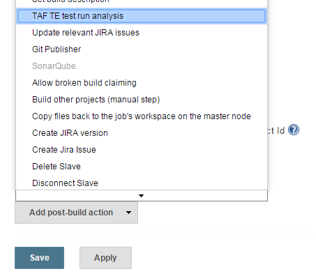
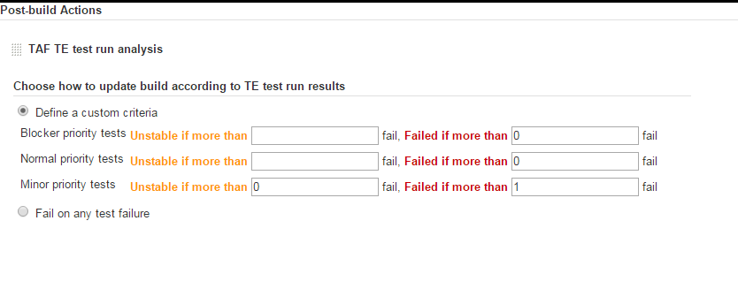
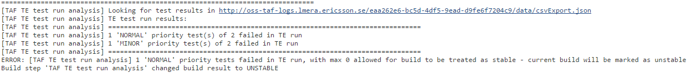
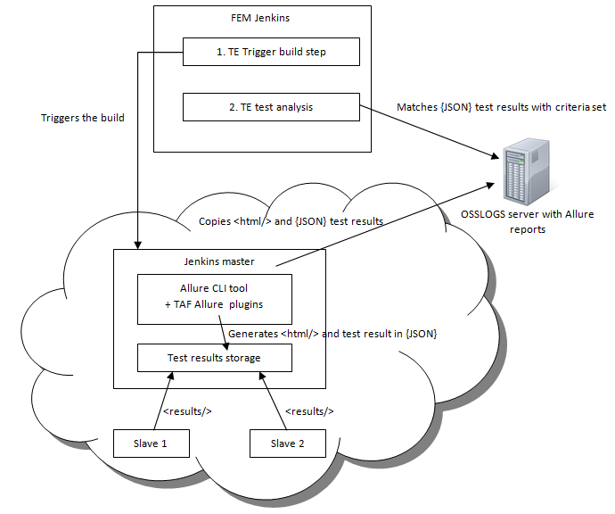

<head>
    <title>Test Results Analysis</title>
</head>

#Test results analysis

##Overview

TAF TE Trigger plugin provides a post-build action that you can use to define the criteria for failure/success of the test run.

>Post-build action in Jenkins job is something that gets executed after build has finished (all build steps finished), regardless of whether it failed or succeeded. It's like a finally block in try/catch Java expression.

Once the plugin is installed, you will see the appropriate entry in the post-build action options, in the Jenkins job configuration:

It adds the following entry to the job configuration:

##How this works

Each box corresponds to an appropriate test category and contains a threshold: the amount of failed tests. If the specified value is exceeded, the build will be marked as unstable or failed.

If the threshold field is left blank, then the appropriate verification will not be made. For example, to make the build fail on any blocker test failure, leave "Unstable" threshold undefined, and set the "Failed" field to 0. But be aware: if you leave both fields blank, blocker test failures will be ignored.

Zero doesn't mean "undefined", it means "if any test fails". "Undefined" is an empty text box, and it means "bypass this check".

Alternatively, you can select the "Fail on any test failure" option if you want such behaviour, and do not want to analyze test results.

###Trigger build step also contains "Fail build on tests failure" option. What's the difference?

Jenkins build executes all build steps one by one. If "Fail build on tests failure" is checked in Trigger build step, it will make Jenkins cancel all subsequent build steps (decide whether you want such behaviour) and proceed with post-build actions like the one described in this article.

###What if the build already failed before the test analysis is performed?

Test analysis is run only when the build status is Success or Unstable. It will bypass its test results checks if the build already failed before, because it cannot get worse.

Test analysis can only make build result worse, it will not mark unstable build as successful if all tests succeeded.

###What if TE build failed due to some technical reasons, not due to test failures?

This will not make any difference: test analysis will not get invoked, and the build will remain as failed.

###Can I see some details of decision making in console?

Yes, you'll find a summary in the Jenkins job console. Something like this:

###What if I set a threshold too high to catch any failures?

 1. This is not recommend.
 2. If you have done this, you can still check the console (see previous point)

###Technical implementation

The implementation is described in Test results analysis - proposal (solution #2).

In a nutshell it works like this:

JSON generation is powered by TAF plugins for Allure.
