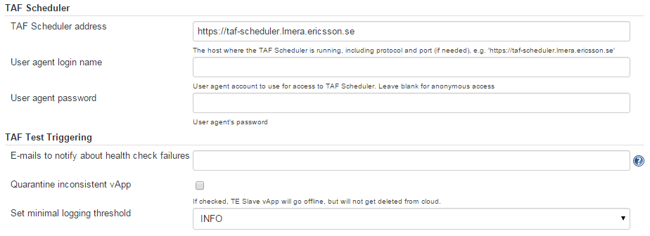
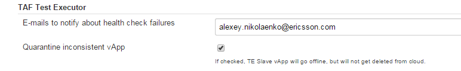
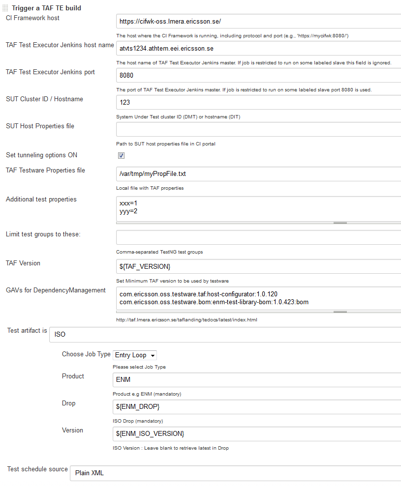
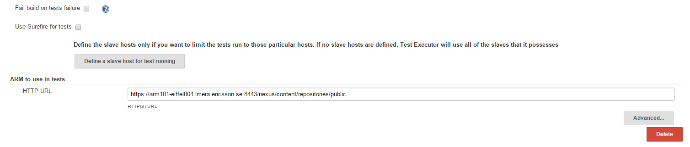
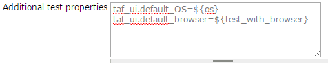

<head>
    <title>TE Trigger Plugin</title>
</head>

# TE Trigger plugin

TAF TE Trigger plugin enables the scheduling of test builds in TAF Test Executor environment, based on testware mappings and
host definitions in CI portal.

##Installation

For installation guidelines please see [Trigger set-up](te_trigger_setup.html)

## Global configuration

(Manage Jenkins -> Configure System)

**Note:** Setting minimum logging threshold, sets the logging level for TE and does not effect the logging level of the testware being run.

### TAF Scheduler

Settings for integration with TAF Scheduler, used by Trigger plugin as the main [schedule source](schedule_source.html).

**TAF Scheduler address** is needed if you use TAF Scheduler to keep your TE schedules.

User agent and password are the credentials for TAF Scheduler REST API.

You don't need to configure any of these settings, as by default the correct values will be set. However, keep an eye
on their correctness.

### TAF Test Triggering

Common settings for test triggering.

TAF TE Trigger plugin checks the integrity of the cloud TE vApp that was selected by the Jenkins label for the tests
execution before the execution starts. If a vApp fails the health check, it’s quarantined, and in case of such a problem the
appropriate persons are notified.

Example:

More about TE slave node health check can be found [here](te_slave_health_check.html).

## Job configuration

Using Trigger plugin you can define some extra parameters for your tests - e.g., Selenium Grid location.

All you need is to add a *Trigger TAF Executor build* build step to your Jenkins job configuration.

Sample view:

* **TAF Test Executor Jenkins host name** - default vApp to use for test run. Leave blank if [TE Cloud is being used](te_cloud.html).
* **TAF Test Executor Jenkins port** - Jenkins port on the default vApp to use for test run. Leave blank if [TE Cloud is being used](te_cloud.html).
* **SUT Cluster ID** - is a mandatory field defining the appropriate Cluster ID in CI portal.
* **SUT Host Properties file** - optional field. Path to SUT host properties file in CI portal.
* **Set tunneling options ON** - if checked, the host properties returned by CI portal (they are mapped to the package you defined above) will contain the information about tunneling.
* **TAF Testware Properties file** - optional field. The file with properties to be injected into TAF testware run. As opposed to CI properties file (SUT Host Properties file), this is a local filesystem file that should exist and should have been created on one of the previous build steps. Please note that the properties will not be propagated to JVM environment - but they will be available via DataHandler.getAttribute(<property_name>) call.
* **Additional test properties** - optional field. This allows you to pass test properties into the TAF testware run.
* **Limit tests groups to these** - optional field. This allows you to override any TestNG groups set in the schedule.
* **TAF Version** - optional field. This will override the version of TAF specified in Teams testsware only if it is a newer version.
* **GAVs for DependencyManagement** - optional field. This allows you to add GAVs to the testware poms DependencyManagement section. By adding ':bom' at the end of the GAV it will be added with &lt;scope&gt;import&lt;/scope&gt; and &lt;type&gt;bom&lt;/type&gt;. This will add them in the order specified so normal dependencies may need to be above the Bom dependencies if the Bom also imports the GAV specified.
* **Test artifact** - is mandatory. See [available options](rfa_kgb_tests.html).
* **Test schedule source** -is mandatory. See [available options](schedule_source.html).

Below are the sections with additional job details:

* **Fail build on tests failure** - if checked, this will cancel all subsequent Build Steps, and will mark the build as failed if any test has failed. [TAF TE test run analysis](/te_test_result_analysis.html) post-build action will be bypassed as well. Since Trigger plugin 1.0.35 this option is NOT recommended. Use TAF TE test run analysis post-build action to alter the build status based on test results.
* **Slave hosts** - optional field set. Depicts the particular TE Slaves that will be used for tests execution (with addresses that are local to TE gateway).
If no slaves are defined (by default), the tests will be run on ALL available TE slaves in TE vApp (normally 2-3 slaves) - recommended setting.
* **ARM to use in tests** -is mandatory. Define the HTTP URL. This URL will be used in TE to retrieve the schedule artifact, and will be added to the list of Maven repositories on slave host machines for the duration of the test run.

**Make sure that the schedule artifact which you have defined in the job configuration can be found either in this ARM or in the ARM configured on TE slave hosts.**

## Hosts and properties overriding in tests

Test running in TE gives you an opportunity to avoid the hard-coded host definitions and properties.
Trigger Plugin will load the host properties from CI portal, it will take the custom properties you have defined
in the job configuration - and pass it all to the TE engine. If your TAF testware uses hosts or properties with the same
names, they will be overridden by TE. This is a convenient way to run your testware using data loaded
from an appropriate environment.

For example, you can have a Selenium Grid host 'sGrid' definition in your TAF host properties - **atvts123.ericcson.se**.
If CI portal hosts definition contains 'sGrid' with address **atvts456.ericcson.se**, any tests that use this host
will use the grid at **atvts456.ericcson.se**.

Using the TAF TE Trigger plugin you can redefine any non-host TAF property in the **TAF Testware Properties file** or in
**Additional test properties**. For example, if you define a default TAF UI OS to be Windows in your TAF
test properties (taf_ui.default_OS=WINDOWS), you can redefine it in **Additional test properties**.

