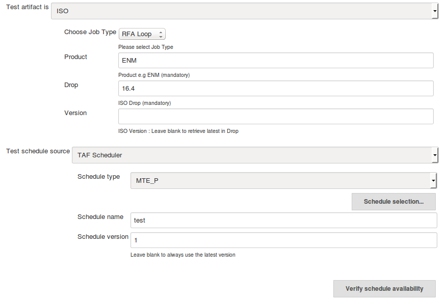
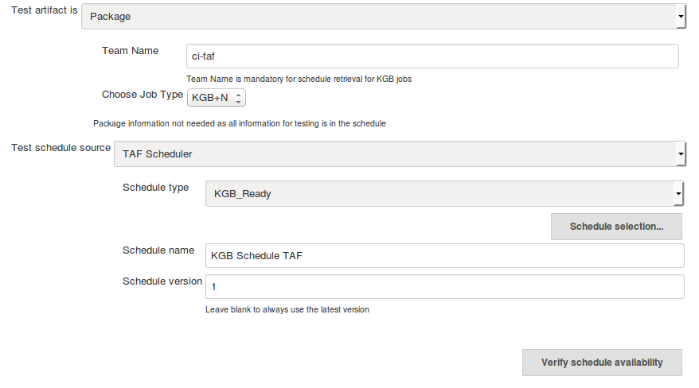

### ISO test artifact

Product and Drop must be specified in order to retrieve schedules when **ISO** is the selected [test artifact](rfa_kgb_tests.html):

In this case your schedule configuration will be bound to product and drop definitions given in ISO definition.

### Package test artifact

Team Name must be specified in order to retrieve schedules when **Package** is the selected [test artifact](rfa_kgb_tests.html):

The testware is specified in the schedule and versions are retrieved from Nexus if they are not specified.