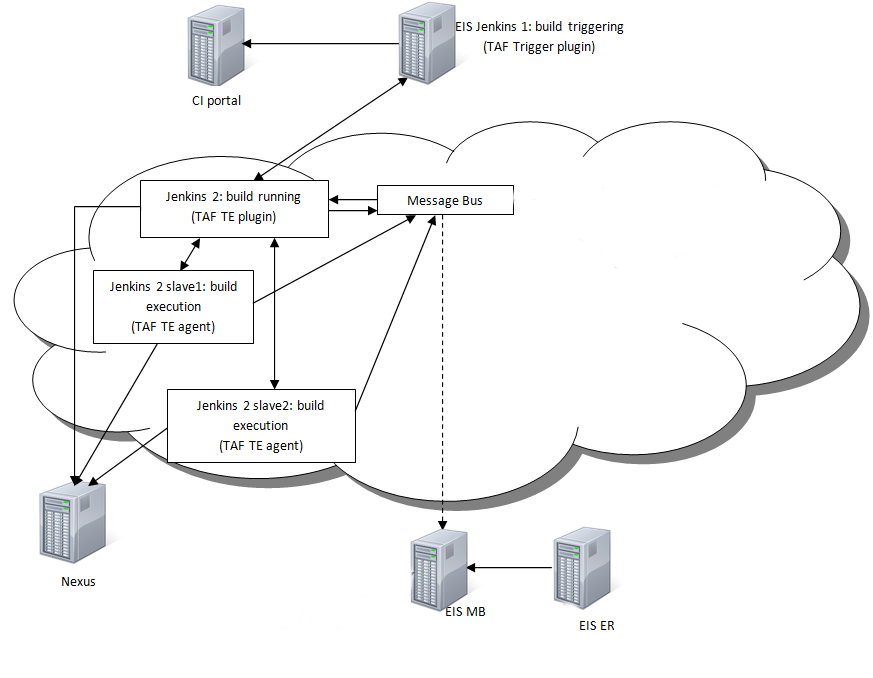

<head>
    <title>TE vApp</title>
</head>

# TE vApp

TAF TE vApp is the vApp that does the real work of test execution.

From end user's perspective this is a black box that runs the tests, reports the test results to Event Repository and
generates Allure reports.

TE vApps can be spun up using templates from the DE-TAF catalogue in the cloud portal.

Templates are managed and created by TAF and CI Execution teams.
